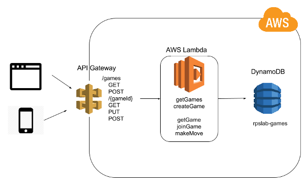
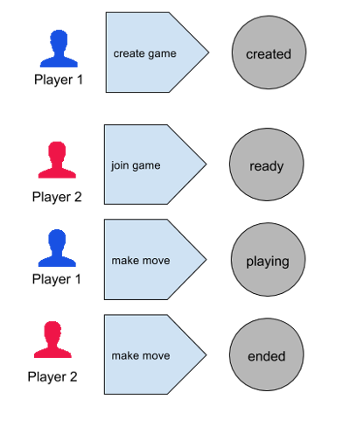

# Serverless rock-paper-scissors lab using AWS Lambda & API Gateway

## Prereqs
* AWS account
* Java 8
* gradle

Use repository

	git clone git@github.com:kobmic/serverless-rps-lab.git
	cd serverless-rps-lab
	
## 0. Naming
When doing this lab in teams, to avoid name conflicts choose a team name and use it when naming lambda functions etc, i.e. "awesomeTeam-helloWorld" instead of "helloWorld" 

## 1. Hello AWS Lambda
You can skip this step if you're already familiar with AWS lamba. In this step you will use a simple Java handler to create a Lambda function.

	cd hello-lambda

	
### AWS Lambda functions in Java	
* must be stateless to enable scaling
* expect local file system access, child processes, and similar artifacts to be limited to the lifetime of the request
* AWS Lambda provides 2 libraries
	* aws-lambda-java-core: provides the Context object, RequestStreamHandler, and the RequestHandler interfaces
	* aws-lambda-java-events:  predefined types that you can use when writing Lambda functions to process events published by i.e. Amazon S3, Amazon Kinesis, Amazon SNS
	
### Add dependencies
Add compile dependencies to your build.gradle:

	'com.amazonaws:aws-lambda-java-core:1.0.0',
    'com.amazonaws:aws-lambda-java-events:1.0.0' 
    
Build

	gradle build
	
### Implement a function handler
Implement a simple function handler in your *HelloLambda* class. Lambda supports two approaches for creating a handler: 

* Loading handler method directly without having to implement an interface
* Implementing standard interfaces **RequestStreamHandler** or **RequestHandler**

First parameter of the handler function is **input**, second parameter the **context**.
Supported input/output types for a handler are: simple Java types (String, Integer, Boolean, Map, and List types) or POJO or Stream type. AWS Lambda serializes based on standard bean naming conventions (use mutable POJOs with public getters and setters).

To learn more about function handlers see [docs.](http://docs.aws.amazon.com/lambda/latest/dg/java-programming-model-handler-types.html)

	public String helloWorld(String input, Context context) {
    	LambdaLogger logger = context.getLogger();
	    logger.log("received : " + input);
        return String.format("Hello %s.", input);
	}

### Invocation types
* RequestResponse invocation type: synchronous, used i.e when testing from AWS Lambda console
* Event invocation type:  asynchronous, used with event sources such as Amazon S3, Amazon Kinesis, and Amazon SNS

### Create a deployment package	
Now you package and upload your code to create your Lambda function. You will specify the **com.jayway.lab.HelloLambda::helloWorld** method reference as the handler.Your deployment package can be a **.zip** file or a standalone **.jar**. The gradle project contains a task for creating a zip:

	gradle buildZip

### Create Lambda Function
* Login to the AWS Lambda console.	
* Choose **Create a Lambda function**
* In step 1 **Select blueprint**, choose the **hello-world** blueprint.
* In step 2 **Configure function** specify *Java* runtime, your handler, upload your zip, and select or create execution role (see below)
* In step 3 **Create function**

### Execution and invocation permissions
You must grant permissions for your Lambda function to access AWS resources like S3, DynamoDB or others. These are granted via an IAM role, called **execution role**. The entity invoking your Lambda function must have permission to do so. I.e. S3 or API Gateway needs permission to invoke your lambda function. See [docs](https://docs.aws.amazon.com/lambda/latest/dg/intro-permission-model.html#lambda-intro-execution-role) 

### Test
* Configure a sample event in the console and test your lambda function.

## 2. Create a lambda function that consumes JSON
Write a new lambda function **createGame** that consumes and produces JSON. Upload and test.

example JSON in:
	
	{"name": "Player1", email: "player1@gmail.com" }

example JSON out:	

	{"gameid": "unique-gameid-could-be-uuid"}

	

## 3. Hello API Gateway
You can skip this step if you're already familiar with AWS API Gateway. In this step, you will see how to use API Gateway to create a custom API, connect your custom API to a AWS Lambda function, and then call the Lambda function from a client through API Gateway.

### Basic Concepts
* REST API defined as set of **resources** and **methods** 
* HTTP(s) endpoints for Lambda functions and other AWS Services
* For every resource specify one or more methods to invoke it
* Integration types:
	* Lambda Function 	
	* HTTP Proxy
	* Mock Integration
	* AWS Sevice Proxy

To learn more about API Gateway see [docs](http://docs.aws.amazon.com/apigateway/latest/developerguide/welcome.html)

### Create API
* in AWS API Gateway console **Create API**
* add resource **games** to your API
* create method **POST** for this resource, choose integration type **Lambda Function** and select region and function **createGame**

### Models and Mapping 
In API Gateway, you use models and mapping templatesto transform data from one schema to another. API Gateway uses the Velocity Template Language (VTL) and JSONPath expressions to define mapping templates. To learn more about models and mapping see [docs](http://docs.aws.amazon.com/apigateway/latest/developerguide/models-mappings.html#models-mappings-mappings)

### Test
* in AWS API Gateway console click **Test** and enter example request body
* if everything works deploy your API 
* the resulting URL will look like

	https://0fjidtcksb.execute-api.eu-west-1.amazonaws.com/your-stage-name
	
Test your endpoint with curl, i.e.

	curl -X POST -H "ContentType: application/json"
	 -d '{"name":"player1","email": "player1@gmail.com"}' 
	 https://0fjidtcksb.execute-api.eu-west-1.amazonaws.com/rpsDevStage/games
	 
## 4. Serverless Rock-Paper-Scissors

In this step you will implement the rock-paper-scissors game using API Gateway & Lambda functions. You will use Amazon Dynamo DB to store your data in table **rpslab-games** in region **eu-west1**. Make sure to add permissions to the execution role you used for your lambda function, i.e.

	{
    	"Effect": "Allow",
        "Action": "dynamodb:*",
        "Resource": "arn:aws:dynamodb:eu-west-1:554360467205:table/rpslab-games"
    } 

### Architecture

### Game states

### Create Game

* Write a lambda function that creates a new game, use **com.jayway.rps.infra.GameStore** utility class to store the new game in DynamoDB. You'll find a project template in directory **serverless-rps**.

Json in:

	{
  		"email": "player1@gmail.com"
	}

Json out:

	{
  		"gameId": "a7f7615c-c385-457c-93a5-1267dfe8787e"
	}

* reuse your API Gateway from above, or create a new one, as before you'll need a **games** resource with method **POST** that will use your lambda function **createGame**
* test your API and make sure the new game is persisted in DynamoDB table **rpslab-games**
* change message repsonse from 200 to 201

### Get Game

* Implement **GetGameLambda** 

Json in:

	{
  		"gameId": "c89dc950-141e-46ea-9f99-b1f54fb9c46d",
	}
	
Json out:

	{
		"gameId": "c89dc950-141e-46ea-9f99-b1f54fb9c46d",
  		"state": "ended",
  		"player1": "player1@gmail.com",
		"player2": "player2@gmail.com",
		"player1Move": "rock",
		"player2Move": "rock",
		"winner": "tie""
	}	
	
* add method **GET** to resource **games/{gameid}** 
* add a mapping to map the path parameter {gameid} to Json
	* in resource view select your new **GET** method
	* choose integration request
	* add mapping template 'application/json' 
	* add template: <code>{ "gameId" : "$input.params('gameid')" } </code>
	

### Join Game

* Implement **JoinGameLambda** 

Json in:

	{
  		"gameId": "c89dc950-141e-46ea-9f99-b1f54fb9c46d",
		"email": "player2@gmail.com"
	}
	
Json out:

	{
		"gameId": "c89dc950-141e-46ea-9f99-b1f54fb9c46d",
  		"state": "ready",
  		"player1": "player1@gmail.com",
		"player2": "player2@gmail.com"
	}	

* add resource **games/{gameid}** with method **PUT**

Mapping for {gameid} and add back remaining JSON properties in request body:
	
	#set($inputRoot = $input.path('$'))
	{ 
  		"gameId" : "$input.params('gameid')",
  		"email": "$inputRoot.email"
	}

### Make Move

* Implement **MakeMoveLambda** 

Json in:

	{
  		"gameId": "c89dc950-141e-46ea-9f99-b1f54fb9c46d",
  		"email": "player1@gmail.com"
	}
	
Json out:

	{
		"gameId": "c89dc950-141e-46ea-9f99-b1f54fb9c46d",
  		"state": "waiting",
  		"player1": "player1@gmail.com",
		"player2": "player2@gmail.com",
		"player1Move": "rock",
	}	

* add method **POST** to resource **games/{gameid}** 

Mapping for {gameid} and add back remaining JSON properties in request body:
	
	#set($inputRoot = $input.path('$'))
	{ 
  		"gameId" : "$input.params('gameid')",
  		"email": "$inputRoot.email",
  		"move": "$inputRoot.move"
	}

### Get Games

* Implement **MakeMoveLambda**

Json in:

	{
  		"state": "created"
	}
	
Json out:

	[
  	  {
    	"gameId": "a6e1efd2-952d-4ea2-982a-663a12ac3a24",
	    "state": "created",
    	"player1": "mike@gmail.com"
	  },
  	  {
    	"gameId": "b5c9be16-5633-40ae-950c-a8b33a171d48",
    	"state": "created",
    	"player1": "mike@gmail.com"
  	  }
    ]	

* add method **GET** to resource **games**
* use a query parameter *state* to query games by state, i.e. <code>/games?state=ended</code>

Mapping for query parameter *state*:
	
	{ 
  		"state" : "$input.params('state')"
  	}

### Test
Test your API with curl.

## Where to go from here
If you still want to code more here are some ideas.

### Implement highscore
Implement a highscore feature for the rps game. Checkout the 'dynamo-process-stream' blueprint in AWS Lmabda. It's an DynamoDB trigger that logs updates to a table. Implement a lambda function that gets the updates, and when receiving an update for a game that's ended, update a **highscore** collection, i.e, "player, wins, losts, ties".

### Upload player image
Upload player image to s3, write a lambda function that listens to **s3:ObjectCreated:*** events, scale the upload image and displays it in the highscore list.

 
 

